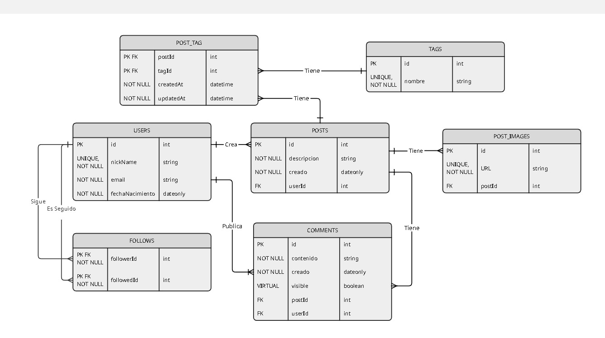

# Red Anti-Social

## Universidad Nacional de Hurlingham
## Trabajo Practico Nº 1 - Estrategias de Persistencia
### 2do Cuatrimestre - Año 2025

### Docentes
- Gerardo Gonzalez Tulian

### Grupo 9
#### Integrantes:

- Asam Fernando Raul

## Descripcion del Proyecto

Red Anti-Social es una aplicacion que implementa a modo de MVP el backend de una red social cuyas funcionalidades principales son:
- Crear usuarios
- Crear y asociar posts a usuarios
- Crear y asociar imagenes, tags y comentarios a posts
- Seguir a otros usuarios
- Actualizacion, consulta y borrado de datos

Entre los distintos tipos de consultas a la base de datos implementadas se encuentran:
- Listado completo de registros de cada entidad.
- Consultas de registros individuales de cada entidad por ID, Ej: consultar un usuario por id.
- Consultas de registros de una entidad asociada a otra/s, Ej: todos los posts de un usuario.
- Consulta de registros segun antiguedad, Ej: comentarios con antiguedad menor a 6 meses.

Para mantener la consistencia de los datos se implementaron middlewares y schemas mediante la libreria Joi que permiten validar parametros, contenido del body y existencia de registros en la BD.

La aplicacion permite configurar las variables de entorno necesarias para su ejecucion como:
- El puerto de ejecucion donde se reciben las peticiones
- El motor de base de datos que se desea implementar
- Visibilidad de comentarios por antiguedad

El proyecto cuenta con documentacion completa de cada endpoint en formato **YAML** que puede consultarse en http://localhost:3006/api-docs.
El puerto de ejecucion por defecto es el 3006 configurado tanto en la [📄 documentación YAML](./src/docs/Documentacion_API_Red_Anti-Social.yaml) como
en la [📄 configuracion de variables de entorno ](./.env).

- **Se configuró una carpeta json prueba en "./src/json" prueba con archivos para realizar consultas con cada endpoint que cuenta con los datos necesarios para realizar una carga en la BD.**

## Caracteristicas

### Diagrama Entidad-Relacion



## Entidades
Cada entidad tiene el fin de registrar:

**Users**:
- a cada usuario de la red social con una fecha de nacimiento, un nickName y un mail unicos.

**Posts**:
- los posts que crea cada usuario con un un fecha de creacion y una descripcion obligatoria.

**Post_Images**:
- las imagenes que se asocian a cada post con una url unica.

**Tags**:
- los tags que se asocian a cada post con un nombre unico.

**Comments**:
- los comentarios que realiza un usuario sobre los posts de otro con una fecha de creacion y un contenido.
- Permite calcular un atributo virtual de visibilidad por antiguedad para mostrar solo los que tienen menos de X meses de publicado.

**Follows**:
- a los usuarios que siguen y a quienes son seguidos por otros con una clave primaria compuesta a partir del id de ambos.

## Tecnologias utilizadas

- Node
- Sequelize ORM
- Express
- Joi

## 📦 Dependencias

#### ⚙️ Produccion

```json
  "dependencies": {
    "cors": "^2.8.5",  // --> Permite las peticiones desde un origen o URL distinto al de la API
    "dotenv": "^17.2.3",  // --> Carga las variables de entorno del archivo .env en process.env
    "express": "^5.1.0",  // --> Permite configurar un servidor web y la API 
    "joi": "^18.0.1",   // --> Valida las request del body con esquemas
    "mysql2": "^3.15.2", // --> Controlador de Node para conexion y consultas a una bd MySQL
    "sequelize": "^6.37.7",  // --> Traduce el codigo Javascript a SQL
    "sqlite3": "^5.1.7",  // --> Motor de base de datos
    "swagger-ui-express": "^5.0.1",  // --> Genera la interfaz web con los endpoints que documenta el archivo YAML
    "yamljs": "^0.3.0" // --> permite cargar leer o escribir archivos YAML con Javascript
  }
```

#### 🧰 Desarrollo

```json
  "devDependencies": {
    "nodemon": "^3.1.10", // --> Reinicia la app cada vez que se guarda un cambio en el codigo automaticamente
    "sequelize-cli": "^6.6.3" // --> Manejo de la BD y creacion de la estructura del proyecto sequelize  a partir de comandos de terminal
  }
```

#### Utilizar nodemon:
- Para utilizar la libreria nodemon se debe configurar el **package.json** en la propiedad scripts el punto de entrada de la app como **"dev": "nodemon src/main.js"**

```json
{
  "name": "anti-social",
  "version": "1.0.0",
  "description": "UnaHur anti-social net - Trabajo Práctico",
  "main": "index.js",
  "scripts": {
    "dev": "nodemon src/main.js", // --> Configurar propiedad
    "test": "echo \"Error: no test specified\" && exit 1"
  },
```
    
## Correr el Proyecto

### Clonar el proyecto

```bash
  git clone https://github.com/EP-UnaHur-2025C2/anti-social-relational-grupo-9.git
```

### Ir a la carpeta raíz

```bash
  cd anti-social-relational-grupo-9
```

### Abrir desde raíz con Vs Code

```bash
  code .
```

### Instalar dependencias

```bash
  npm install
```

### Configuracion de las variables de entorno
Desde el archivo ['.env'](./.env). pueden configurarse
- El puerto de ejecucion
- Antiguedad maxima de visualizacion de los comentarios
- Motor de base de datos, nombre de bd, credenciales

**Ej. de Configuracion para SQLite**

- Crear una carpeta que contenga el archivo de la BD local con extension .sqlite en la raiz del proyecto.

**Instalar dependencia sqlite3** 
```bash
npm i sqlite3
```

**Configurar path del volumen de la bd local y dialecto**

```bash
   PORT = 3006
   MAX_COMMENT_VISIBILITY_MONTH = 6

   DB_USERNAME = ''
   DB_PASSWORD = ''
   DB_NAME = 'db_dev'
   DB_HOST = 'localhost'
   DB_STORAGE = 'data/data.sqlite'
   DB_DIALECT = 'sqlite'
```

**Ej. de Configuracion para MySQL**

Instalar la version de MySQL Community server segun el SO disponible en
https://dev.mysql.com/downloads/mysql/

**Instalar dependencia mysql2**
```bash
npm i mysql2
```

**Configurar credenciales y dialecto**

```bash
   PORT = 3006
   MAX_COMMENT_VISIBILITY_MONTH = 6

   DB_USERNAME = 'root'
   DB_PASSWORD = '1234'
   DB_NAME = 'db_dev'
   DB_HOST = 'localhost'
   DB_STORAGE = ''
   DB_DIALECT = 'mysql'
```
A modo de prueba en cotexto de desarrollo para crear las tablas en la BD antes de correr el proyecto descomentar el comando **await db.sequelize.sync({force:true});** en la linea 26 de main.js.

**Advertencia**: al ejecutar **await db.sequelize.sync({force:true});** se pierden los datos grabados en la BD ya que dropea las tablas y las crea de nuevo.

#### Correr el proyecto

```bash
  npm run dev
```

## Endpoints

### 🧑 Users

```
/users:
   ├── get: Listar todos los usuarios
   └── post: Crear un nuevo usuario

/users/:id:
   ├── get: Obtener usuario por ID
   ├── put: Actualizar un usuario por ID
   └── delete: Borrar un usuario por ID

/users/:id/posts:
   └── get: obtener todos los posts de un usuario por ID

/users/:id/images:
   └── get: Obtener todas las imagenes de un usuario por ID
   
/users/:id/create-post:
   └── post: Crear un post para un usuario

/users/:id/create-post-full:
   └── post: Crear un post con imagenes y tags para un usuario
```

### 📄 Posts

```
/posts:
   ├── get: Lista todos los posts
   └── post: Crear un nuevo post

/posts/comments:
   └── get: Lista todos los posts con imagenes, tags y comentarios
   
/posts/:id:
   ├── get: Obtener un post por ID
   ├── put: Actualizar un post por ID
   └── delete: Borrar un post por ID
   
/posts/:id/comments:
   └── get: Obtener post con imagenes, tags y comentarios por ID
      
/posts/:id/create-images:
   └── post: Crear imagenes para un post
      
/posts/:id/create-tags:
   └── post: Crear tags para un post
      
/posts/:id/create-comment:
   └── post: Crear comentario para un post
```

### 🖼️ Images

```
/images:
   └── get: Listar todas las imagenes
   
/images/:id:
   ├── get: Obtener una imagen por ID
   └── delete: Borrar un imagen por ID
   
/images/:id/tags:
   └── get: Obtener todos los tags de una imagen por ID
```

### 🏷️ Tags

```
/tags:
   └── get: Lista todos los tags
   
/tags/:id:
   ├── get: Obtener un tag por ID
   ├── put: Actualizar un tag por ID
   └── delete: Borrar un tag por ID
      
/tags/:id/posts:
   └── get: Obtener todos los posts de un tag por ID
   
/tags/:id/images:
   └── get: Obtener todas las imagenes de un tag por ID
   
/tags/:id/users:
   └── get: Obtener todos los usuarios de un tag por ID
```

### 💬 Comments

```
/comments:
   └── get: Lista todos los comentarios
   
/comments/:id:
   ├── get: Obtener un comentario por ID
   ├── put: Actualizar un comentario por ID
   └── delete: Borrar un comentario por ID
   
/comments/recent:
   └── get: Lista todos los comentarios con menos de 6 meses de antiguedad
   
/comments/post/{postId}/user/{userId}:
   └── get: Lista todos los comentarios de un usuario en un post
   
/comments/recent/post/:id:
   └── get: Lista todos los comentarios de un post con menos de 6 meses de antiguedad
   
/comments/user/:id:
   └── get: Lista todos los comentarios de un usuario
```

### 🤝 follows

```
/follows:
   └── get: Lista todos los follows
      
/follows/{id}/create-follow:
   └── post: Crear un nuevo follow
      
/follows/{id}/followers:
   └── get: Lista todos los seguidores de un usuario
      
/follows/{id}/followings:
   └── get: Lista todos los seguidos por un usuario
      
/follows/{id}/update-follow:
   └── put: Actualizar a un usuario seguido por ID
      
/follows/{id}/delete-follow:
   └── delete: Borrar un follow por ID
```

## Estructura del Proyecto

```
📁 anti-social-relational-grupo-9
├── 📁 assets
├── 📁 data
│   └── data.sqlite
├── 📁 src
│   ├── 📁 controllers
│   │   ├── comment.controller.js
│   │   ├── follow.controller.js
│   │   ├── generic.controller.js
│   │   ├── index.js
│   │   ├── post.controller.js
│   │   ├── post_image.controller.js
│   │   ├── tag.controller.js
│   │   └── user.controller.js
│   ├── 📁 db
│   │   ├── 📁 config
│   │   │   ├── config.js
│   │   │   └── config.json
│   │   ├── 📁 migrations
│   │   │   ├── 20251004225736-create-user.js
│   │   │   ├── 20251004230616-create-post.js
│   │   │   ├── 20251004230931-create-post-image.js
│   │   │   ├── 20251004231045-create-tag.js
│   │   │   ├── 20251004231147-create-comment.js
│   │   │   └── 20251017040648-create-follow.js
│   │   ├── 📁 models
│   │   │   ├── comment.js
│   │   │   ├── follow.js
│   │   │   ├── index.js
│   │   │   ├── post.js
│   │   │   ├── post_image.js
│   │   │   ├── tag.js
│   │   │   └── user.js
│   │   └── 📁 seeders
│   ├── 📁 docs
│   │   ├── Diagrama_DER.jpg
│   │   └── Documentacion_API_Red_Anti-Social.yaml
│   ├── 📁 Json prueba
│   │   ├── 📁 pruebas commentController
│   │   │   ├── createComment.json
│   │   │   └── updateComment.json
│   │   ├── 📁 pruebas followController
│   │   │   ├── createFollow.json
│   │   │   ├── deleteFollow.json
│   │   │   └── updateFollow.json
│   │   ├── 📁 pruebas postController
│   │   │   ├── createAssociateComment.json
│   │   │   ├── createAssociateImages.json
│   │   │   ├── createAssociatePost.json
│   │   │   ├── createAssociateTags.json
│   │   │   ├── createPost.json
│   │   │   ├── createPostFull.json
│   │   │   └── updatePost.json
│   │   ├── 📁 pruebas post_imageController
│   │   │   ├── createImage.json
│   │   │   └── updateImage.json
│   │   ├── 📁 pruebas tagController
│   │   │   ├── createTag.json
│   │   │   └── updateTag.json
│   │   └── 📁 pruebas userController
│   │       ├── createUser.json
│   │       └── updateUser.json
│   ├── 📁 middlewares
│   │   ├── comment.middleware.js
│   │   ├── follow.middleware.js
│   │   ├── generic.middleware.js
│   │   ├── index.js
│   │   ├── post.middleware.js
│   │   ├── post_image.middleware.js
│   │   ├── tag.middleware.js
│   │   └── user.middleware.js
│   ├── 📁 routes
│   │   ├── comment.route.js
│   │   ├── follow.route.js
│   │   ├── index.js
│   │   ├── post.route.js
│   │   ├── post_image.route.js
│   │   ├── tag.route.js
│   │   └── user.route.js
│   └── 📁 schemas
│       ├── comment.schema.js
│       ├── follow.schema.js
│       ├── generic.schema.js
│       ├── index.js
│       ├── post.schema.js
│       ├── post_image.schema.js
│       ├── tag.schema.js
│       └── user.schema.js
├── .env
├── package.json
├── .sequelizerc
├── README.md
└── main.js
```
##### * generado con tree node-cli
